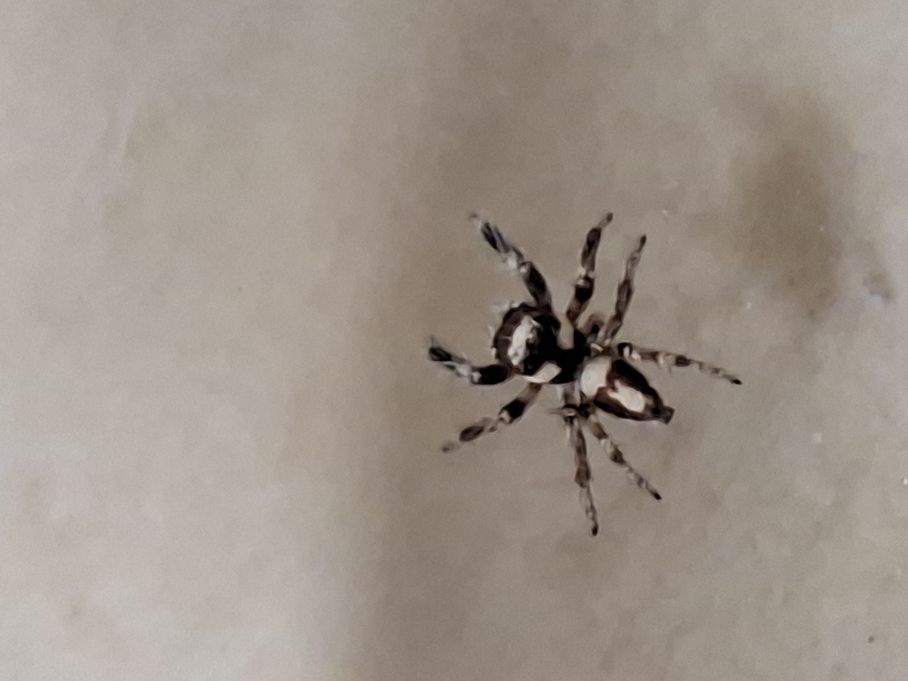

# Jumping spider photographed in Be'er Ya'akov, Israel

An archive of 32 photographs taken in Be'er Ya'akov, Israel, on **9 October 2026**, with the observation details, image validation results, and a provisional identification developed by visually reviewing the complete set.

**Best current identification: probable *Pellenes flavipalpis* (Lucas, 1853), apparently an adult male, in the jumping-spider family Salticidae.** The family identification is confident; the genus and species are photographic interpretations, with the species remaining provisional. This archive does not record a specialist-confirmed or specimen-based determination.

> Probable *Pellenes flavipalpis*, adult male — Be'er Ya'akov, Israel — 9 October 2026, approximately 13:26–13:31 local time (UTC+03:00).

## Observation and photographic record

| Field | Archived information |
| --- | --- |
| Location | Be'er Ya'akov, Israel; explicitly supplied by the photographer. |
| Encounter | The photographer reports that the spider was crawling on their bed. No bite or symptoms were reported in the discussion. |
| Observation date | 9 October 2026; the photographer described the observation as happening "now" during the identification discussion, and the image timestamps record the same date. |
| Capture interval | EXIF `DateTimeOriginal`: 13:26:28–13:31:29, a span of 5 minutes 1 second. |
| Time offset | EXIF `OffsetTimeOriginal`: `+03:00` in all 32 files. |
| Photographs | 32 JPEG files, apparently showing the same individual from different angles and under different lighting. |
| Lighting | The photographer reports using a flashlight and flash. The recorded EXIF `Flash` value is `0` in every file, so the reported lighting methods are preserved without assigning a method to each frame. |
| Size | The spider's body length was not measured or supplied. The repository name `huge_spider` is not a size measurement. |
| Review | All 32 photographs were visually inspected during the identification discussion. |

The original filenames are retained. Several filename timestamps are one second earlier than their EXIF capture times; the inventory below records EXIF times explicitly. Device timestamps have not been independently calibrated.

## Identification evidence and limits

The first assessment identified the spider only as a jumping spider. Reviewing the remaining photographs, including the illuminated views and images showing silk, revealed a more useful combination of markings and led to the provisional *Pellenes flavipalpis* identification. The photographer subsequently supplied the location in Israel, which is consistent with that species' accepted distribution.

The features visible across the photographs are:

- A compact jumping-spider body form with a broad front body section and stout front legs.
- A conspicuous white patch on top of the head and two separate pale patches farther back.
- A broad pale marking at the front of the abdomen and an elongated white marking along its rear midline.
- Dark, apparently swollen tips on the pedipalps, the small appendages beside the mouth, supporting the interpretation of an adult male.

The closest published comparison found during the review was the male *Pellenes flavipalpis* in **Figure 15g–h, printed page 80, of Schäfer (2020)**. The same study discusses the frontal white head patch as a feature distinguishing *P. flavipalpis* from the similar *P. geniculatus* on page 83. The resemblance to those reference photographs is the basis of this identification; the paper does not identify the individual in this repository. [Schäfer's study and comparison plates](https://arages.de/user_upload/psb_publicationmanagement/pdf/AM59_72_87.pdf)

The World Spider Catalog accepts *Pellenes flavipalpis* and lists its distribution as Greece, including Crete, Turkey, Cyprus, Lebanon, and **Israel**. The location therefore supports the proposed identification, but does not uniquely determine the species. Older literature may use *Pellenes simoni*, which the catalog treats as a synonym of *P. flavipalpis*. [World Spider Catalog species account](https://wsc.nmbe.ch/spec-data/38263)

The published male body length is approximately **3.0–3.5 mm, excluding the legs**. This is a reference measurement, not a measurement of the photographed spider. A substantially larger measured body would be a reason to revisit the identification. [Spiders of Europe species description](https://araneae.nmbe.ch/data/2078/Pellenes_flavipalpis?lang=en)

Confidence is highest for Salticidae, lower for the genus and male/adult interpretation, and lower again for the exact species. The photographs document useful markings, but fine diagnostic anatomy is not sufficiently resolved for a definitive species determination. The observation date and time are retained as context; no species-specific seasonal conclusion was established.

## Photographs most useful for review

| Photograph | Contribution to the identification |
| --- | --- |
| [20261009_132919.jpg](20261009_132919.jpg) | Clear dorsal pattern: the white head patch, separate pale patches behind it, and posterior abdominal marking. |
| [20261009_133024.jpg](20261009_133024.jpg) | A second dorsal view showing the same arrangement of markings against a reflective background. |
| [20261009_132648.jpg](20261009_132648.jpg) | Front/side view of the stout front legs and the apparently swollen, dark-tipped pedipalps. |
| [20261009_132642.jpg](20261009_132642.jpg) | Additional view of the front appendages, useful alongside the preceding photograph. |
| [20261009_133046.jpg](20261009_133046.jpg) | Side view and a fine silk strand extending from the rear of the abdomen. |
| [20261009_133059.jpg](20261009_133059.jpg) and [20261009_133102.jpg](20261009_133102.jpg) | Additional illuminated views useful for inspecting the silk and body outline. |
| [20261009_133118.jpg](20261009_133118.jpg) and [20261009_133129.jpg](20261009_133129.jpg) | Further illuminated views of the head, body, and legs. |

The different lighting and angles help distinguish persistent white markings from reflections and highlights. These files should be considered together rather than treating any one exposure as a complete record of the spider's coloration.

## Silk observations

A fine strand is visible extending from the rear of the abdomen, particularly in [20261009_133046.jpg](20261009_133046.jpg). It is consistent with a **dragline**, a silk safety tether. That is an interpretation of the visible strand, not an observation of the spider constructing a complete web or capturing prey.

Spiders use silk for safety lines as well as other purposes, and jumping spiders also make silken retreats. The presence of silk is compatible with the jumping-spider identification. [Australian Museum: silk and draglines](https://australian.museum/learn/animals/spiders/silk-the-spiders-success-story/), [Australian Museum: jumping spiders and their silken retreats](https://australian.museum/learn/animals/spiders/jumping-spiders/)

## Bed sighting and practical safety guidance

After supplying the location, the photographer reported finding the spider crawling on their bed and asked whether it was dangerous or safe to cuddle with. On the photographic identification as a jumping spider, the expected risk from its presence is low. Jumping spiders are generally not considered to have medically significant bites, although a bite can cause local discomfort and individual reactions can vary. This is general guidance for jumping spiders, not a species-specific clinical finding about *P. flavipalpis*. [Penn State Extension: jumping-spider bite significance](https://extension.psu.edu/zebra-jumper), [Penn State Extension: reported symptoms from a jumping-spider bite](https://extension.psu.edu/bold-jumper-spider)

The practical recommendation is to move the spider off the bed before lying down or sleeping. Being trapped against skin by bedding can provoke a defensive bite, and rolling onto it could injure or kill it. Use a cup and a stiff card to move it gently to a nearby sheltered place away from the bedding; avoid squeezing it or deliberately trapping it against bare skin. [University of California IPM: bites when spiders are pressed or lain on](https://ipm.ucanr.edu/home-and-landscape/spiders/), [Australian Museum: catching a spider with a jar and card](https://australian.museum/learn/animals/spiders/spider-bites-and-venoms/)

If an actual bite occurs, wash the area with soap and water and apply a cold compress. Seek medical advice for substantially worsening pain or swelling, and urgent help for breathing difficulty or other signs of a severe allergic reaction. No treatment is indicated solely because a spider was seen on the bed. [Poison Control: bite care and when to seek help](https://www.poison.org/articles/insect-and-spider-bites)

## File integrity and archive provenance

The initial file-validation task was performed **without visual inspection**, before the photographer requested visual identification. All 32 images passed:

- Pillow `verify()` and a full pixel decode with `load()`, with truncated-image loading disabled and warnings treated as errors.
- A separate strict FFmpeg decode check.

| Validation item | Result |
| --- | --- |
| Valid images | 32 of 32 |
| Invalid images detected | 0 |
| File format | JPEG |
| Stored pixel dimensions | 4000 × 3000 for every image |
| Color mode | RGB |
| Total image bytes | 48,476,758 |
| Initial image commit | [`16cc2c7914a167e25eab6b30221042973f4f9a2b`](https://github.com/BigBIueWhale/huge_spider/commit/16cc2c7914a167e25eab6b30221042973f4f9a2b) |
| Public repository | [BigBIueWhale/huge_spider](https://github.com/BigBIueWhale/huge_spider) |

Stored pixel dimensions describe the encoded raster. EXIF orientation affects how a viewer displays each image.

The validation established that the supplied files could be decoded successfully; it does not establish biological identification or photographic sharpness. During README preparation, the complete file inventory and all SHA-256 hashes were checked against the original validation manifest and matched. The archived JPEG bytes were not changed by this documentation work. No generated enhancement was used as identification evidence.

This README records the photographer's statements, file metadata, and an AI-assisted visual interpretation from the discussion on 9 October 2026. Future identification corrections can be recorded through repository history while preserving the original photographs and the provisional nature of this assessment.

Complete image inventory, EXIF capture times, sizes, and SHA-256 checksums

All times below are on 9 October 2026 at the recorded offset `+03:00`. Checksums apply to the complete JPEG files, including their metadata.

| File | EXIF time | Bytes | SHA-256 |
| --- | --- | ---: | --- |
| [20261009_132628.jpg](20261009_132628.jpg) | 13:26:28 | 3,709,463 | `2dd3a24c78bdc34c26342e03441e1edb16e19b7d077467170bdef664780e8cb9` |
| [20261009_132634.jpg](20261009_132634.jpg) | 13:26:34 | 1,221,126 | `f5bd0ea568bac9db3ad49d0dece429d217e82b93b0eec8a4c7af46a91aace810` |
| [20261009_132642.jpg](20261009_132642.jpg) | 13:26:42 | 1,139,118 | `02629f2fdcd595dc8e1bc95939b75f381e73b5cb4142470ae87ef90a6de5efce` |
| [20261009_132648.jpg](20261009_132648.jpg) | 13:26:49 | 1,184,731 | `183d956a985853884d7e7389d6b679d4357c2a882dcbf1ab204bdd824fdc4db5` |
| [20261009_132714.jpg](20261009_132714.jpg) | 13:27:14 | 1,670,503 | `4ad0ea6f9a5e84534ccf68ffdf20603bd6b006607f1bdbe447028304c50753ba` |
| [20261009_132715.jpg](20261009_132715.jpg) | 13:27:15 | 1,655,661 | `2aa1d6c7299de9eca52e9f322570d3470d79f98c10ce8c84f9963ded0a5e9220` |
| [20261009_132716.jpg](20261009_132716.jpg) | 13:27:16 | 1,658,971 | `117db37d869fdda72a3bcb186e01a9f70d72fb7fb05c6ecc56827d6cb920818e` |
| [20261009_132718.jpg](20261009_132718.jpg) | 13:27:18 | 1,604,778 | `abe95b2d08560ec14d4c2f2a718e10a887126da262af304be497a69c78f5d55a` |
| [20261009_132719.jpg](20261009_132719.jpg) | 13:27:19 | 1,633,488 | `8ce983c2de9477b2302e46fe046158aba888abdbacf642860e012a589ddea6ae` |
| [20261009_132730.jpg](20261009_132730.jpg) | 13:27:31 | 1,729,747 | `842d6c53182b2b71ca346f523ccf69aa41e88234f9d19b4513592da3d5915e52` |
| [20261009_132732.jpg](20261009_132732.jpg) | 13:27:32 | 1,677,009 | `487c8485bd084d7bebfe9c038ded7c8dcb43d4f51f07bc3b27a0fb41eb1ee105` |
| [20261009_132756.jpg](20261009_132756.jpg) | 13:27:56 | 1,627,344 | `c8234e58bd51e07a53ecb749d5a3af4fb68e4a3020465f410828024cd8551bcf` |
| [20261009_132806.jpg](20261009_132806.jpg) | 13:28:06 | 1,827,653 | `10082791eb10bda39fff48f434821837bd880c74c41b8ae8ba9abde728b0b514` |
| [20261009_132820.jpg](20261009_132820.jpg) | 13:28:21 | 1,080,639 | `3a930c08bbb536b7b38f40f51a43df63f6240142328d5092093a1fac85bc4f7b` |
| [20261009_132828.jpg](20261009_132828.jpg) | 13:28:28 | 1,056,573 | `73e9a5570fdeff518ba8d8eb6023d808d8b55f5ef448079cb76ab9f2bb8ffd76` |
| [20261009_132834.jpg](20261009_132834.jpg) | 13:28:34 | 1,058,263 | `d0bb48f935c9c1ce1a40e0935d86ebe95e10ec8671e14b0062b1d6f85c643f16` |
| [20261009_132842.jpg](20261009_132842.jpg) | 13:28:42 | 1,057,743 | `bd258dda4e89cddf898e10a55c1208760a7dd3871f526ff8b79d70b2d7ff39ef` |
| [20261009_132901.jpg](20261009_132901.jpg) | 13:29:01 | 1,076,446 | `8e0f12db58825dfd290168d402e9761935852d367c8b32c006f6eabb508ee55d` |
| [20261009_132903.jpg](20261009_132903.jpg) | 13:29:03 | 1,072,136 | `c33f5f164e9407dce9238e17919b7f8a66c3a8fe5e50b7ad1f0355e6a39a3cb5` |
| [20261009_132907.jpg](20261009_132907.jpg) | 13:29:08 | 1,053,353 | `a62c0d76da600b1eae38ecb1c80acea311ac9942a7a8a84e7a856205dbe02aeb` |
| [20261009_132919.jpg](20261009_132919.jpg) | 13:29:19 | 1,056,871 | `541cdcbbaed01f7cc427e610401dc4e3a16ed148fe3700a6c64fd039e2791b6c` |
| [20261009_132925.jpg](20261009_132925.jpg) | 13:29:25 | 1,039,929 | `323c71bb97def840ca21d3caff14003bfb5dc68e5646621a606c8f6475cb584a` |
| [20261009_132939.jpg](20261009_132939.jpg) | 13:29:39 | 1,059,728 | `b1ffac540f57967d55f41b48a91989f0a6ef2671bdf0921fceb0e4f928c59b10` |
| [20261009_133024.jpg](20261009_133024.jpg) | 13:30:25 | 1,506,698 | `9c22d7cfa00476c68c3076423af846d472462f9aed5af0e841abb7dad3ce2189` |
| [20261009_133041.jpg](20261009_133041.jpg) | 13:30:41 | 1,565,064 | `2ae310572f0ab08f2c079c0b9ad5bb42ea80eddc4f3c5d4a4d4c640319ede131` |
| [20261009_133046.jpg](20261009_133046.jpg) | 13:30:46 | 1,634,282 | `6dad13550ffb21ef125de517dc79c07fd7e4602537863baca8d30c646470ad93` |
| [20261009_133050.jpg](20261009_133050.jpg) | 13:30:50 | 1,586,059 | `d0dd809703c7c0bc1954d2f131b88cc73cf129a549d504ef54e6b5de1a2cf34e` |
| [20261009_133059.jpg](20261009_133059.jpg) | 13:30:59 | 1,921,447 | `fd946a5aae7c1bb0a0ecce8680e2b90909c242c79151454a81c6f791b95edfa6` |
| [20261009_133102.jpg](20261009_133102.jpg) | 13:31:02 | 1,917,320 | `d5e6f9ed06c0c6f0fa20afd74a138622cf23a933aa440ec8599f18415c2ca5b0` |
| [20261009_133112.jpg](20261009_133112.jpg) | 13:31:13 | 1,522,247 | `aaa7eb4977d410b2be8b6564620edc60f37493ac1555f9de3c3d7277e2c3de7d` |
| [20261009_133118.jpg](20261009_133118.jpg) | 13:31:18 | 1,915,514 | `4484596408050b8d3be3d1fa0d195ef45298b46aac0000beb3b347c80a64781f` |
| [20261009_133129.jpg](20261009_133129.jpg) | 13:31:29 | 1,956,854 | `450c18792d32aac4505e526bfd0d3ea6aacc2ffe404d35d9054d03dcbf9b56fc` |

## References

Sources consulted during the identification discussion on 9 October 2026:

1. Schäfer, M. (2020). *Ein Beitrag zur Springspinnenfauna (Araneae: Salticidae) der griechischen Insel Kreta mit der Erstbeschreibung von Pellenes florii sp. nov.* Arachnologische Mitteilungen 59: 72–87. See Figure 15g–h on page 80 and the discussion of *P. flavipalpis* on page 83. [Article PDF](https://arages.de/user_upload/psb_publicationmanagement/pdf/AM59_72_87.pdf), [DOI: 10.30963/aramit5910](https://doi.org/10.30963/aramit5910).
2. Natural History Museum Bern, World Spider Catalog. [*Pellenes flavipalpis* — accepted name, distribution, and taxonomic references](https://wsc.nmbe.ch/lsid/urn:lsid:nmbe.ch:spidersp:035274).
3. Spiders of Europe. [*Pellenes flavipalpis* — description, measurements, and figures](https://araneae.nmbe.ch/data/2078/Pellenes_flavipalpis?lang=en).
4. Australian Museum. [Silk: the spider's success story](https://australian.museum/learn/animals/spiders/silk-the-spiders-success-story/).
5. Australian Museum. [Jumping spiders](https://australian.museum/learn/animals/spiders/jumping-spiders/).
6. Penn State Extension. [Zebra jumper](https://extension.psu.edu/zebra-jumper) and [Bold jumper spider](https://extension.psu.edu/bold-jumper-spider), for general jumping-spider bite guidance, not identification of this individual as either of those species.
7. University of California Statewide IPM Program. [Spiders](https://ipm.ucanr.edu/home-and-landscape/spiders/), for circumstances that can provoke a defensive bite.
8. Australian Museum. [Spider bites and venoms](https://australian.museum/learn/animals/spiders/spider-bites-and-venoms/), for the jar-and-card capture method.
9. Poison Control. [Insect and spider bites: when to worry](https://www.poison.org/articles/insect-and-spider-bites), for general bite care and warning symptoms.
